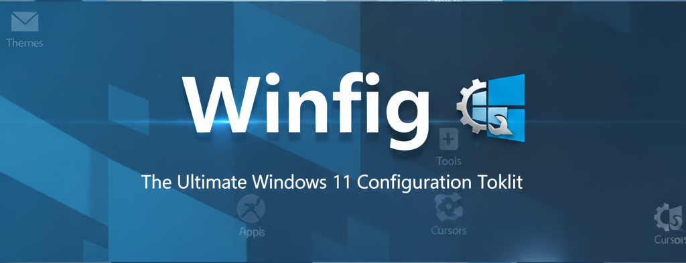

<h1 align="center">Winfig Customization</h1>

A curated collection of Windows customizations to personalize your desktop experience. This repository contains custom cursors, themes, fonts, and other appearance modifications for Windows.

> **📘 Complete Documentation**: For comprehensive guides, tutorials, and detailed information about Winfig, please visit our [official documentation website](https://get-winfig.github.io/winfig-docs/).

---

## 🚀 How to Use

1. **Browse** the folders to find the customization you want
2. **Download** the files you need
3. **Install** following the instructions in each folder
4. **Apply** the customizations through Windows settings

> **⚠️ Note**: Always create a system restore point before applying customizations.

---

## 🤝 Contributing

We welcome contributions to improve the Winfig setup experience! Here's how you can help:

### How to Contribute
1.  **Fork** this repository
2.  **Create** a feature branch (`git checkout -b feature/amazing-feature`)
3.  **Make** your changes with clear, descriptive commits
4.  **Push** to your branch (`git push origin feature/amazing-feature`)
5.  **Submit** a Pull Request with a detailed description

### Contribution Guidelines
- Follow existing code style and conventions
- Test your changes thoroughly
- Update documentation if needed
- Keep commits focused and atomic

---

## 📄 License

This project is licensed under the **MIT License** - see the [LICENSE](LICENSE) file for details.
